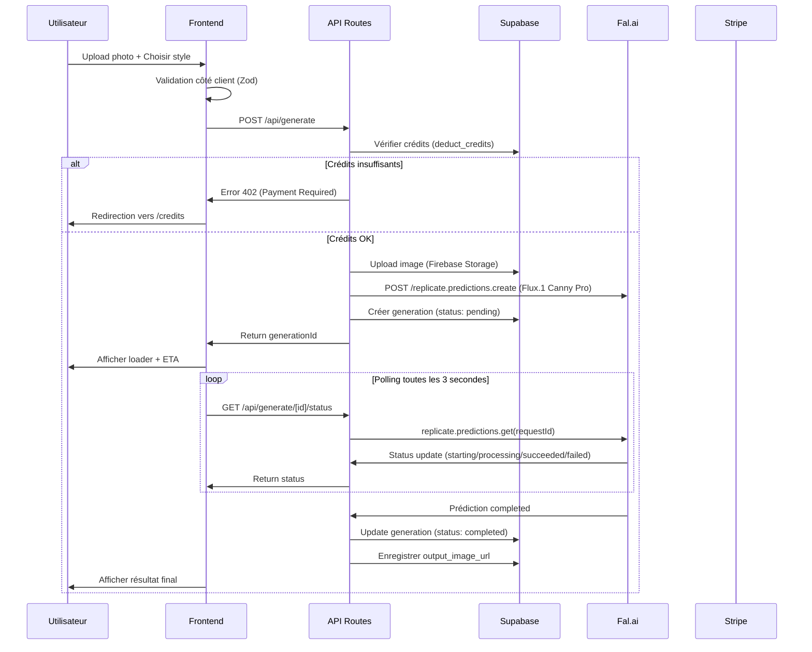

# 🏠 InstaDeco AI - Contrat de Contexte Global

**Date de création :** 16 janvier 2026  
**Version :** 1.3.0  
**Type de projet :** SaaS B2C - Décoration d'intérieur par IA  
**⚡ Optimisation :** Migration Replicate.ai (flux-canny-pro)  
**🎨 Branding :** InstaDeco AI (anciennement InstantDecor)  

---

## 📋 Table des Matières

1. [Vision et Positionnement](#vision-et-positionnement)
2. [Architecture Technique](#architecture-technique)
3. [Structure de la Base de Données](#structure-de-la-base-de-données)
4. [Endpoints API](#endpoints-api)
5. [Architecture de Code](#architecture-de-code)
6. [Flux Utilisateur Principal](#flux-utilisateur-principal)
7. [Système de Crédits et Paiements](#système-de-crédits-et-paiements)
8. [Sécurité et Validation](#sécurité-et-validation)
9. [SEO et Routes Dynamiques](#seo-et-routes-dynamiques)
10. [Milestones de Développement](#milestones-de-développement)
11. [Variables d'Environnement](#variables-denvironnement)

---

## 🎯 Vision et Positionnement

### Concept
**InstaDeco AI** permet aux utilisateurs de transformer leurs photos de pièces en rendus décorés professionnels grâce à l'IA générative (Flux.1 + ControlNet).

### Proposition de Valeur
- ✅ **Rapide** : Génération en moins de 30 secondes
- ✅ **Précis** : Respect de la structure spatiale (ControlNet Canny/Depth)
- ✅ **Flexible** : 20+ styles de décoration (Bohème, Minimaliste, Industriel, etc.)
- ✅ **Accessible** : Modèle de crédits sans abonnement

### Public Cible
- Particuliers en recherche d'inspiration déco
- Agents immobiliers (home staging virtuel)
- Architectes d'intérieur (moodboards rapides)

---

## 🏗️ Architecture Technique

### Stack Principal

| Couche | Technologies |
|--------|-------------|
| **Frontend** | Next.js 14+ (App Router), TypeScript, Tailwind CSS |
| **UI Components** | Shadcn/UI (Radix UI + Tailwind) |
| **Backend** | Next.js API Routes + Firebase Functions |
| **Base de Données** | Firebase Firestore (NoSQL) |
| **Authentification** | Firebase Authentication (Email + OAuth Google) |
| **Stockage Fichiers** | Firebase Storage (Images utilisateurs + générations) |
| **IA Générative** | Replicate.ai - Flux.1 Canny Pro + ControlNet |
| **Paiements** | Stripe (Checkout Sessions + Webhooks) |
| **Validation** | Zod (Schemas TypeScript-first) |
| **Images** | Next/Image (Optimisation WebP automatique) |

### Justifications Techniques

**Pourquoi Next.js App Router ?**
- RSC (React Server Components) pour performance
- Streaming SSR pour UX optimale
- API Routes Edge pour latence minimale

**Pourquoi Replicate.ai + Flux.1 ?**
- **Prix compétitif** : $0.05 par image (vs Fal.ai $0.05-0.08)
- Flux.1 Canny Pro : Meilleure qualité avec ControlNet intégré
- API simple avec SDK officiel (predictions)
- Respect parfait de la géométrie de la pièce (Canny edge detection)
- Scalabilité : 406K+ runs, très populaire
- Commercial use autorisé

**Pourquoi Firebase ?**
- Écosystème complet et mature (Auth + Firestore + Storage + Functions)
- Firestore : base NoSQL scalable avec requêtes temps réel
- Sécurité : Firestore Security Rules (déclaratives)
- Intégration VSCode parfaite (Firebase CLI + Extension)
- Déploiement simple via Firebase Hosting

---

## 🗄️ Structure de la Base de Données

### Schéma Firebase Firestore

#### Architecture NoSQL

Firestore utilise une structure de **collections** et **documents** :

```typescript
// ============================================
// COLLECTION: users
// ============================================
interface User {
  id: string;                    // UID Firebase Auth
  email: string;
  fullName?: string;
  avatarUrl?: string;
  credits: number;               // Default: 3 (crédits gratuits)
  createdAt: Timestamp;
  updatedAt: Timestamp;
}

// ============================================
// COLLECTION: creditTransactions
// ============================================
interface CreditTransaction {
  id: string;
  userId: string;                // Référence au user
  amount: number;                // Positif = ajout, Négatif = débit
  type: 'purchase' | 'usage' | 'refund' | 'bonus';
  stripePaymentIntentId?: string;
  metadata?: Record<string, any>;
  createdAt: Timestamp;
}

// Index Firestore requis:
// - userId (ASC)
// - Composite: userId (ASC) + createdAt (DESC)

// ============================================
// COLLECTION: generations
// ============================================
interface Generation {
  id: string;
  userId: string;                // Référence au user
  
  // Paramètres de génération
  styleSlug: string;             // Ex: 'boheme', 'minimaliste'
  roomTypeSlug: string;          // Ex: 'salon', 'chambre'
  prompt: string;
  negativePrompt?: string;
  controlnetType: 'canny' | 'depth';
  
  // URLs des images
  inputImageUrl: string;         // Image uploadée (Firebase Storage)
  outputImageUrl?: string;       // Résultat généré (NULL si en cours)
  
  // État de la génération
  status: 'pending' | 'processing' | 'completed' | 'failed';
  replicateRequestId?: string;   // ID de la prediction Replicate.ai
  errorMessage?: string;
  
  // Métadonnées
  generationTimeMs?: number;     // Durée de génération
  metadata?: Record<string, any>;
  
  createdAt: Timestamp;
  completedAt?: Timestamp;
}

// Index Firestore requis:
// - userId (ASC) + createdAt (DESC)
// - status (ASC)
// - Composite: userId (ASC) + status (ASC) + createdAt (DESC)

// ============================================
// COLLECTION: styles
// ============================================
interface Style {
  id: string;                    // Slug (ex: 'boheme')
  slug: string;                  // URL-friendly
  name: string;
  description: string;
  thumbnailUrl: string;
  promptTemplate: string;        // Template pour Flux.1
  isActive: boolean;
  sortOrder: number;
  createdAt: Timestamp;
}

// Données initiales (à importer dans Firestore)
const initialStyles = [
  {
    slug: 'boheme',
    name: 'Bohème Chic',
    description: 'Style hippie moderne avec textiles naturels',
    promptTemplate: 'bohemian interior design, natural textures, warm colors, macramé, plants',
    isActive: true,
    sortOrder: 1,
  },
  {
    slug: 'minimaliste',
    name: 'Minimaliste Scandinave',
    description: 'Lignes épurées, tons neutres, bois clair',
    promptTemplate: 'minimalist scandinavian interior, clean lines, neutral colors, light wood',
    isActive: true,
    sortOrder: 2,
  },
  {
    slug: 'industriel',
    name: 'Industriel Moderne',
    description: 'Briques apparentes, métal, esprit loft',
    promptTemplate: 'industrial loft interior, exposed brick, metal fixtures, concrete',
    isActive: true,
    sortOrder: 3,
  },
  {
    slug: 'moderne',
    name: 'Moderne Contemporain',
    description: 'Design actuel, fonctionnel, élégant',
    promptTemplate: 'modern contemporary interior, sleek design, elegant, functional',
    isActive: true,
    sortOrder: 4,
  },
  {
    slug: 'classique',
    name: 'Classique Élégant',
    description: 'Moulures, mobilier traditionnel, raffinement',
    promptTemplate: 'classic elegant interior, traditional furniture, refined details',
    isActive: true,
    sortOrder: 5,
  },
];

// ============================================
// COLLECTION: roomTypes
// ============================================
interface RoomType {
  id: string;                    // Slug (ex: 'salon')
  slug: string;
  name: string;
  icon: string;                  // Emoji
  isActive: boolean;
  createdAt: Timestamp;
}

// Données initiales (à importer dans Firestore)
const initialRoomTypes = [
  { slug: 'salon', name: 'Salon', icon: '🛋️', isActive: true },
  { slug: 'chambre', name: 'Chambre', icon: '🛏️', isActive: true },
  { slug: 'cuisine', name: 'Cuisine', icon: '🍳', isActive: true },
  { slug: 'salle-de-bain', name: 'Salle de Bain', icon: '🚿', isActive: true },
  { slug: 'bureau', name: 'Bureau', icon: '💼', isActive: true },
  { slug: 'salle-a-manger', name: 'Salle à Manger', icon: '🍽️', isActive: true },
];

// ============================================
// FIRESTORE SECURITY RULES
// ============================================

-- Activer RLS sur toutes les tables
ALTER TABLE public.users ENABLE ROW LEVEL SECURITY;
ALTER TABLE public.credit_transactions ENABLE ROW LEVEL SECURITY;
ALTER TABLE public.generations ENABLE ROW LEVEL SECURITY;

-- Politique: Les utilisateurs ne peuvent voir que leurs propres données
CREATE POLICY "Users can view own profile" ON public.users
  FOR SELECT USING (auth.uid() = id);

CREATE POLICY "Users can update own profile" ON public.users
  FOR UPDATE USING (auth.uid() = id);

CREATE POLICY "Users can view own transactions" ON public.credit_transactions
  FOR SELECT USING (auth.uid() = user_id);

CREATE POLICY "Users can view own generations" ON public.generations
  FOR SELECT USING (auth.uid() = user_id);

CREATE POLICY "Users can insert own generations" ON public.generations
  FOR INSERT WITH CHECK (auth.uid() = user_id);

-- Tables publiques (lecture seule)
ALTER TABLE public.styles ENABLE ROW LEVEL SECURITY;
ALTER TABLE public.room_types ENABLE ROW LEVEL SECURITY;

CREATE POLICY "Styles are viewable by everyone" ON public.styles
  FOR SELECT USING (is_active = TRUE);

CREATE POLICY "Room types are viewable by everyone" ON public.room_types
  FOR SELECT USING (is_active = TRUE);

// Voir le fichier firestore.rules pour les règles complètes

// ============================================
// FONCTIONS UTILITAIRES (Firebase Admin SDK)
// ============================================

// Fonction: Déduire des crédits (transaction atomique)
// Voir lib/firebase/admin.ts - deductCredits()
async function deductCredits(userId: string, amount: number): Promise<boolean> {
  // Transaction Firestore atomique
  // 1. Vérifier le solde
  // 2. Déduire les crédits
  // 3. Enregistrer la transaction
  // Retourne false si solde insuffisant
}

// Fonction: Ajouter des crédits (achat)
// Voir lib/firebase/admin.ts - addCredits()
async function addCredits(
  userId: string,
  amount: number,
  stripePaymentIntentId?: string
): Promise<void> {
  // Transaction Firestore atomique
  // 1. Ajouter les crédits
  // 2. Enregistrer la transaction d'achat
}
```

**📚 Documentation complète:** Voir [docs/FIRESTORE_SCHEMA.md](FIRESTORE_SCHEMA.md)

---

## 🔌 Endpoints API

### Architecture API Routes (Next.js)

```
app/api/
├── auth/
│   ├── callback/route.ts          # Callback OAuth Firebase
│   └── logout/route.ts             # Déconnexion
├── generate/
│   ├── route.ts                    # POST - Démarrer génération
│   └── [id]/
│       └── status/route.ts         # GET - Vérifier statut
├── credits/
│   ├── balance/route.ts            # GET - Solde de l'utilisateur
│   └── history/route.ts            # GET - Historique des transactions
├── payments/
│   ├── create-checkout/route.ts    # POST - Créer session Stripe
│   └── webhook/route.ts            # POST - Webhook Stripe
├── styles/
│   └── route.ts                    # GET - Liste des styles
├── rooms/
│   └── route.ts                    # GET - Types de pièces
└── generations/
    ├── route.ts                    # GET - Générations de l'utilisateur
    └── [id]/route.ts               # GET - Détails d'une génération
```

### Spécifications des Endpoints

#### 1. **POST /api/generate**
Démarre une nouvelle génération d'image.

**Request Body (Zod Schema):**
```typescript
{
  styleSlug: string;        // Ex: "boheme"
  roomTypeSlug: string;     // Ex: "salon"
  controlnetType?: "canny" | "depth"; // Default: "canny"
  customPrompt?: string;    // Prompt additionnel
  imageFile: File;          // Image uploadée (max 10MB)
}
```

**Response:**
```typescript
{
  generationId: string;     // UUID de la génération
  status: "pending";
  estimatedTimeMs: number;  // Estimation ~25000ms
}
```

**Logique:**
1. Valider les crédits de l'utilisateur (1 crédit requis)
2. Uploader l'image vers Supabase Storage
3. Déduire 1 crédit via `deduct_credits()`
4. Créer un enregistrement dans `generations` (status: pending)
5. Envoyer requête à Replicate.ai avec Flux.1 Canny Pro + ControlNet
6. Retourner l'ID de génération

---

#### 2. **GET /api/generate/[id]/status**
Vérifie l'état d'une génération (polling).

**Response:**
```typescript
{
  id: string;
  status: "pending" | "processing" | "completed" | "failed";
  outputImageUrl?: string;  // Si completed
  errorMessage?: string;    // Si failed
  progress?: number;        // 0-100 (si Replicate.ai le fournit)
}
```

---

#### 3. **POST /api/payments/create-checkout**
Crée une session Stripe Checkout pour acheter des crédits.

**Request Body:**
```typescript
{
  packId: "starter" | "pro" | "unlimited"; // Pack de crédits
}
```

**Packs disponibles:**
- **Starter**: 10 crédits → 9.99€
- **Pro**: 30 crédits → 24.99€
- **Unlimited**: 100 crédits → 69.99€

**Response:**
```typescript
{
  checkoutUrl: string; // URL de la page Stripe
}
```

---

#### 4. **POST /api/payments/webhook**
Webhook Stripe pour valider les paiements (Event: `checkout.session.completed`).

**Logique:**
1. Vérifier la signature Stripe (`stripe.webhooks.constructEvent`)
2. Récupérer le `user_id` depuis les metadata
3. Appeler `add_credits()` avec le montant du pack
4. Envoyer un email de confirmation (optionnel)

---

#### 5. **GET /api/generations**
Liste les générations de l'utilisateur (paginé).

**Query Params:**
- `page` (default: 1)
- `limit` (default: 20)
- `status` (optional): "completed" | "failed"

**Response:**
```typescript
{
  generations: Array<{
    id: string;
    styleSlug: string;
    roomTypeSlug: string;
    inputImageUrl: string;
    outputImageUrl: string | null;
    status: string;
    createdAt: string;
  }>;
  pagination: {
    total: number;
    page: number;
    limit: number;
  };
}
```

---

## 🧩 Architecture de Code

### Principes d'Organisation

```
/app                          # Next.js App Router
  /(auth)                     # Routes authentification
    /login/page.tsx
    /signup/page.tsx
  /(dashboard)                # Routes protégées
    /dashboard/page.tsx       # Historique des générations
    /generate/page.tsx        # Interface de génération
    /credits/page.tsx         # Gestion des crédits
  /(marketing)                # Routes publiques
    /page.tsx                 # Landing page
    /style/[slug]/page.tsx    # Pages dynamiques par style (SEO)
    /piece/[slug]/page.tsx    # Pages dynamiques par pièce (SEO)
    /pricing/page.tsx
  /api                        # API Routes (voir section précédente)
  /layout.tsx                 # Layout racine
  /globals.css                # Styles Tailwind

/components
  /ui                         # Composants Shadcn/UI réutilisables
    /button.tsx
    /card.tsx
    /dialog.tsx
    /input.tsx
    /select.tsx
  /layout                     # Composants de mise en page
    /header.tsx
    /footer.tsx
    /sidebar.tsx
  /features                   # Composants métier
    /image-upload.tsx         # Zone de drag & drop
    /style-selector.tsx       # Grille de sélection de styles
    /generation-card.tsx      # Carte d'une génération
    /credit-badge.tsx         # ✅ Badge de crédits (real-time Firestore)
    /protected-route.tsx      # ✅ Wrapper protection auth

/lib
  /db
    /supabase.ts              # Client Supabase (server & client)
    /queries.ts               # Requêtes réutilisables
  /ai
    /fal-client.ts            # Client Replicate.ai + types (migré de Fal.ai)
    /prompts.ts               # Templates de prompts
  /payments
    /stripe.ts                # Client Stripe + webhooks
  /validations
    /schemas.ts               # Schemas Zod (generate, payment, etc.)
  /utils
    /cn.ts                    # Utilitaire classnames (Shadcn)
    /format.ts                # Formatage dates, nombres
    /image.ts                 # Compression, conversion WebP

/types
  /database.ts                # Types générés depuis Supabase
  /api.ts                     # Types des API routes
  /models.ts                  # Types métier (Generation, User, etc.)

/hooks
  /use-credits.ts             # Hook pour gérer les crédits
  /use-generation.ts          # ✅ Hook auth Firebase (onAuthStateChanged)de génération
  /use-auth.ts                # Hook auth Supabase

/public
  /images
    /styles                   # Thumbnails des styles
    /examples                 # Exemples de transformations
```

### Exemple de Composant Atomique

```typescript
// components/features/style-selector.tsx
import { Card } from "@/components/ui/card";
import Image from "next/image";

interface Style {
  slug: string;
  name: string;
  thumbnail_url: string;
}

export function StyleSelector({ 
  styles, 
  selected, 
  onSelect 
}: {
  styles: Style[];
  selected: string | null;
  onSelect: (slug: string) => void;
}) {
  return (
    <div className="grid grid-cols-2 md:grid-cols-4 gap-4">
      {styles.map((style) => (
        <Card
          key={style.slug}
          className={`cursor-pointer transition-all ${
            selected === style.slug ? 'ring-2 ring-primary' : ''
          }`}
          onClick={() => onSelect(style.slug)}
        >
          <Image
            src={style.thumbnail_url}
            alt={style.name}
            width={300}
            height={200}
            className="rounded-t-lg"
          />
          <p className="p-4 text-center font-medium">{style.name}</p>
        </Card>
      ))}
    </div>
  );
}
```

---

## 🔄 Flux Utilisateur Principal

### Scénario: Générer une Décoration



---

## 💳 Système de Crédits et Paiements

### Modèle Économique

| Action | Coût |
|--------|------|
| Génération Flux.1 + ControlNet | **1 crédit** |
| Inscription (bonus) | **3 crédits gratuits** |

### Packs Stripe

```typescript
// lib/payments/pricing.ts
export const CREDIT_PACKS = {
  starter: {
    id: 'starter',
    credits: 10,
    priceEur: 9.99,
    priceId: 'price_starter_xxx', // ID Stripe
  },
  pro: {
    id: 'pro',
    credits: 30,
    priceEur: 24.99,
    priceId: 'price_pro_xxx',
    popular: true, // Badge "Populaire"
  },
  unlimited: {
    id: 'unlimited',
    credits: 100,
    priceEur: 69.99,
    priceId: 'price_unlimited_xxx',
  },
} as const;
```

### Gestion des Webhooks Stripe

**Configuration requise:**
1. Créer un webhook sur Stripe Dashboard → `https://yourdomain.com/api/payments/webhook`
2. Écouter l'événement `checkout.session.completed`
3. Valider la signature avec `STRIPE_WEBHOOK_SECRET`

**Code type:**
```typescript
// app/api/payments/webhook/route.ts
import { stripe } from '@/lib/payments/stripe';
import { add_credits } from '@/lib/db/queries';

export async function POST(req: Request) {
  const sig = req.headers.get('stripe-signature')!;
  const body = await req.text();
  
  const event = stripe.webhooks.constructEvent(
    body,
    sig,
    process.env.STRIPE_WEBHOOK_SECRET!
  );
  
  if (event.type === 'checkout.session.completed') {
    const session = event.data.object;
    const userId = session.metadata?.user_id;
    const credits = parseInt(session.metadata?.credits || '0');
    
    await add_credits(userId, credits, session.payment_intent);
  }
  
  return new Response('OK', { status: 200 });
}
```

---

## 🔒 Sécurité et Validation

### Validation des Entrées (Zod)

```typescript
// lib/validations/schemas.ts
import { z } from 'zod';

export const generateImageSchema = z.object({
  styleSlug: z.string().min(1, 'Style requis'),
  roomTypeSlug: z.string().min(1, 'Type de pièce requis'),
  controlnetType: z.enum(['canny', 'depth']).default('canny'),
  customPrompt: z.string().max(500).optional(),
  imageFile: z
    .instanceof(File)
    .refine((file) => file.size <= 10 * 1024 * 1024, 'Fichier max 10MB')
    .refine(
      (file) => ['image/jpeg', 'image/png', 'image/webp'].includes(file.type),
      'Format accepté: JPEG, PNG, WebP'
    ),
});
```

### Protection des Routes

**Middleware Supabase (app/middleware.ts):**
```typescript
import { createMiddlewareClient } from '@supabase/auth-helpers-nextjs';
import { NextResponse } from 'next/server';
import type { NextRequest } from 'next/server';

export async function middleware(req: NextRequest) {
  const res = NextResponse.next();
  const supabase = createMiddlewareClient({ req, res });
  
  const { data: { session } } = await supabase.auth.getSession();
  
  // Protéger /dashboard et /generate
  if (req.nextUrl.pathname.startsWith('/dashboard') && !session) {
    return NextResponse.redirect(new URL('/login', req.url));
  }
  
  return res;
}

export const config = {
  matcher: ['/((?!api|_next/static|_next/image|favicon.ico).*)'],
};
```

### Rate Limiting

**Protection contre l'abus (lib/rate-limit.ts):**
```typescript
import { LRUCache } from 'lru-cache';

const rateLimitCache = new LRUCache<string, number>({
  max: 500,
  ttl: 60000, // 1 minute
});

export function rateLimit(identifier: string, limit = 10) {
  const count = rateLimitCache.get(identifier) || 0;
  
  if (count >= limit) {
    return { success: false, remaining: 0 };
  }
  
  rateLimitCache.set(identifier, count + 1);
  return { success: true, remaining: limit - count - 1 };
}
```

---

## 🔍 SEO et Routes Dynamiques

### Structure des URLs

```
/                          → Landing page
/style/boheme              → Page style "Bohème Chic" (SSG)
/style/minimaliste         → Page style "Minimaliste" (SSG)
/piece/salon               → Page pièce "Salon" (SSG)
/piece/chambre             → Page pièce "Chambre" (SSG)
/pricing                   → Tarifs
/dashboard                 → Dashboard utilisateur (protégé)
/generate                  → Interface de génération (protégé)
```

### Génération Statique (SSG)

**app/(marketing)/style/[slug]/page.tsx:**
```typescript
import { createServerClient } from '@/lib/db/supabase';
import { Metadata } from 'next';

export async function generateStaticParams() {
  const supabase = createServerClient();
  const { data: styles } = await supabase
    .from('styles')
    .select('slug')
    .eq('is_active', true);
  
  return styles?.map((style) => ({ slug: style.slug })) || [];
}

export async function generateMetadata({ 
  params 
}: { 
  params: { slug: string } 
}): Promise<Metadata> {
  const supabase = createServerClient();
  const { data: style } = await supabase
    .from('styles')
    .select('*')
    .eq('slug', params.slug)
    .single();
  
  return {
    title: `Style ${style?.name} - InstantDecor AI`,
    description: style?.description,
    openGraph: {
      images: [style?.thumbnail_url],
    },
  };
}

export default async function StylePage({ 
  params 
}: { 
  params: { slug: string } 
}) {
  // Contenu de la page...
}
```

---

## 📅 Milestones de Développement

### Phase 1: MVP Core (Semaines 1-2)

#### Milestone 1.1 - Setup Projet ✅
- [x] Initialiser Next.js + TypeScript + Tailwind
- [x] Configurer Firebase (Database + Auth + Storage)
- [ ] Installer Shadcn/UI (composants de base)
- [ ] Setup Stripe (mode test)
- [x] Configurer variables d'environnement
- [x] **Firebase Auth configuré (email + Google OAuth)**
- [x] **Pages login/signup créées**
- [x] **Hook useAuth implémenté**

**Livrables:**
- ✅ Projet initialisé avec structure de dossiers
- ✅ Projet Firebase créé (instantdecor-ai)
- ✅ Variables d'environnement configurées
- ✅ **Authentification complète (email + Google OAuth)**
- ✅ **Création automatique profil Firestore (3 crédits gratuits)**
- ✅ **Déploiement Vercel actif (instantdecor-ai.vercel.app)**

---

#### Milestone 1.2 - Interface de Génération
- [ ] Composant `ImageUpload` (drag & drop)
- [ ] Composant `StyleSelector` (grille de styles)
- [ ] Composant `RoomTypeSelector`
- [ ] Page `/generate` avec formulaire complet
- [ ] Validation Zod côté client

**Livrables:**
- Interface fonctionnelle pour uploader une image
- Sélection de style et type de pièce
- Validation des entrées

---

#### Milestone 1.3 - Intégration Replicate.ai ✅
- [x] Client Replicate.ai dans `lib/ai/fal-client.ts`
- [x] Endpoint `POST /api/generate`
- [x] Endpoint `GET /api/generate/[id]/status`
- [ ] Upload d'images vers Firebase Storage
- [x] Système de polling côté frontend
- [x] **Migration de Fal.ai → Replicate.ai (flux-canny-pro)**

**Livrables:**
- ✅ Génération d'images fonctionnelle avec Replicate SDK
- ✅ Affichage du résultat en temps réel
- ✅ Gestion des erreurs
- ✅ ControlNet Canny intégré (edge detection parfait)
- ✅ Documentation de migration complète

--- 🔄
- [ ] Implémenter fonctions Firestore (`deductCredits`, `addCredits`)
- [ ] Tester les transactions atomiques
- [x] **Créer composant `CreditBadge` (real-time updates)**
- [x] **Créer composant `ProtectedRoute`**
- [x] **Middleware de protection routes**

**Livrables:**
- 🔄 Système de crédits fonctionnel (UI ✅, Backend à faire)
- ✅ Affichage du solde en temps réel (Firestore onSnapshot)
- ✅ Protection routes authentifiées`

**Livrables:**
- Système de crédits fonctionnel
- Affichage du solde en temps réel

---

#### Milestone 2.2 - Paiements Stripe
- [ ] Page `/pricing` avec les 3 packs
- [ ] Endpoint `POST /api/payments/create-checkout`
- [ ] Endpoint `POST /api/payments/webhook`
- [ ] Tester le flux complet (sandbox)

**Livrables:**
- Achat de crédits fonctionnel
- Webhooks validés
- Redirection après paiement

---

### Phase 3: Dashboard et Historique (Semaine 4)

#### Milestone 3.1 - Dashboard Utilisateur
- [ ] Page `/dashboard` avec liste des générations
- [ ] Endpoint `GET /api/generations`
- [ ] Composant `GenerationCard`
- [ ] Pagination et filtres (status)
- [ ] Bouton "Re-télécharger" pour chaque image

**Livrables:**
- Historique complet des générations
- Possibilité de retrouver ses créations

---

#### Milestone 3.2 - Optimisations
- [ ] Compression des images (WebP)
- [ ] Lazy loading des générations
- [ ] Cache API (React Query ou SWR)
- [ ] Loading skeletons

---

### Phase 4: SEO et Landing Page (Semaine 5)

#### Milestone 4.1 - Pages Dynamiques SEO
- [ ] Pages `/style/[slug]` (SSG)
- [ ] Pages `/piece/[slug]` (SSG)
- [ ] Metadata OpenGraph optimisés
- [ ] Schema.org JSON-LD

**Livrables:**
- Pages indexables par Google
- Partage optimisé sur réseaux sociaux

---

#### Milestone 4.2 - Landing Page
- [ ] Hero section avec démo vidéo
- [ ] Section "Avant/Après" (carousel)
- [ ] Section "Comment ça marche" (3 étapes)
- [ ] Section "Styles disponibles" (grille)
- [ ] FAQ
- [ ] Footer avec liens légaux

**Livrables:**
- Landing page complète et responsive
- CTA vers inscription

---

### Phase 5: Polish et Lancement (Semaine 6)

#### Milestone 5.1 - Tests et Corrections
- [ ] Tests utilisateurs (5-10 bêta-testeurs)
- [ ] Corrections de bugs
- [ ] Optimisations performance (Lighthouse > 90)
- [ ] Tests sur mobile

---

#### Milestone 5.2 - Production
- [ ] Déploiement sur Vercel (Edge Network)
- [ ] Configuration DNS
- [ ] Stripe en mode production
- [ ] Monitoring (Sentry ou LogRocket)
- [ ] Analytics (Google Analytics 4)

**Livrables:**
- Application en production
- Monitoring actif

---

## 🔐 Variables d'Environnement

**Fichier `.env.local` (à créer):**

```bash
# ============================================
# NEXT.JS
# ============================================
NEXT_PUBLIC_APP_URL=http://localhost:3000

# ============================================
# FIREBASE
# ============================================
NEXT_PUBLIC_FIREBASE_API_KEY=AIza...
NEXT_PUBLIC_FIREBASE_AUTH_DOMAIN=instantdecor-ai.firebaseapp.com
NEXT_PUBLIC_FIREBASE_PROJECT_ID=instantdecor-ai
NEXT_PUBLIC_FIREBASE_STORAGE_BUCKET=instantdecor-ai.appspot.com
NEXT_PUBLIC_FIREBASE_MESSAGING_SENDER_ID=123456789
NEXT_PUBLIC_FIREBASE_APP_ID=1:123456789:web:abc123def456

# Service Account (Server-side uniquement)
FIREBASE_SERVICE_ACCOUNT_KEY=./firebase-service-account.json

# ============================================
# REPLICATE.AI (migré depuis Fal.ai)
# ============================================
REPLICATE_API_TOKEN=r8_xxxxxxxxxxxxxxxxxxxxxxxxxxxxx
# Modèle: black-forest-labs/flux-canny-pro
# Version: fb49cfe622c16ec5e8ad1c20e80b1faab5e1f2f87e1e3b24c2d0af8a6d4f2f4c
# Prix: $0.05 par image (vs Fal.ai $0.05-0.08)
# ControlNet Canny intégré pour préservation structure

# ============================================
# STRIPE
# ============================================
NEXT_PUBLIC_STRIPE_PUBLISHABLE_KEY=pk_test_xxxxx
STRIPE_SECRET_KEY=sk_test_xxxxx
STRIPE_WEBHOOK_SECRET=whsec_xxxxx

# Prix IDs (créés dans Stripe Dashboard)
STRIPE_PRICE_STARTER=price_xxxxx
STRIPE_PRICE_PRO=price_xxxxx
STRIPE_PRICE_UNLIMITED=price_xxxxx

# ============================================
# SÉCURITÉ
# ============================================
RATE_LIMIT_MAX_REQUESTS=10 # Requêtes par minute
```

**Fichier `.env.example` (à commiter):**
Copie du fichier ci-dessus avec des valeurs `your_xxx_here`.

---

## 📚 Ressources et Documentation

### Documentation Officielle
- [Next.js App Router](https://nextjs.org/docs)
- [Firebase Documentation](https://firebase.google.com/docs)
- [Firestore Guide](https://firebase.google.com/docs/firestore)
- [Firebase Auth Guide](https://firebase.google.com/docs/auth)
- [Replicate.ai API Reference](https://replicate.com/docs)
- [Replicate Flux Canny Pro](https://replicate.com/black-forest-labs/flux-canny-pro)
- [Stripe Checkout](https://stripe.com/docs/payments/checkout)
- [Shadcn/UI Components](https://ui.shadcn.com)

### Documentation Projet
- **Migration Replicate:** [docs/REPLICATE_MIGRATION.md](REPLICATE_MIGRATION.md)

### Outils de Développement
- **Base de Données:** Firebase Console (interface visuelle)
- **CLI:** Firebase Tools (installé localement dans le projet)
- **Paiements:** Stripe Dashboard (gestion des produits/webhooks)
- **Déploiement:** Vercel (déploiement automatique via Git)
- **Monitoring:** Vercel Analytics + Sentry (erreurs)

---

## 🎯 Prochaines Étapes Immédiates

### ✅ Complété (17 janvier 2026)
- ✅ Firebase Auth configuré (email + Google OAuth)
- ✅ Pages login/signup fonctionnelles
- ✅ CreditBadge avec mises à jour temps réel
- ✅ Protection des routes authentifiées
- ✅ Déploiement Vercel actif

### ✅ Complété (19 janvier 2026)
- ✅ **Rebranding InstaDeco AI** (anciennement InstantDecor)
- ✅ **Optimisation mobile complète** (responsive design)
- ✅ **Carousel pricing mobile** (swipe + indicateurs)
- ✅ **Fix erreurs console** (favicon, icons PWA)
- ✅ **Page Demo fonctionnelle** avec résultat exemple
- ✅ **Page Pricing responsive** (3 packs de crédits)
- ✅ **PWA manifest configuré** (InstaDeco AI)

### 🔄 En Cours (Milestone 2)
1. **Implémenter déduction crédits** lors de la génération
2. **Créer collections Firestore** (styles, roomTypes)
3. **Intégrer Firebase Storage** pour uploads d'images
4. **Créer produits Stripe TEST** (Starter, Pro, Unlimited)

### 📋 À Faire (Priorité)
1. **Implémenter fonctions Firestore** (`deductCredits`, `addCredits`)
2. **Modifier `/api/generate`** pour déduire 1 crédit
3. **Créer collection `creditTransactions`** (audit trail)
4. **Configurer Stripe Checkout** (mode test)
5. **Créer icônes PWA** (192x192, 512x512 PNG)
6. **Tester flux complet** inscription → génération → paiement

---

**Dernière mise à jour:** 19 janvier 2026  
**Mainteneur:** @gabrielmoustadrif  
**Version du contexte:** 1.3.0  
**Changelog:** 
- v1.3.0 (19/01) - Rebranding InstaDeco AI + Optimisation mobile complète
- v1.2.0 (17/01) - Milestone 1.1 complété (Firebase Auth + UI crédits)
- v1.1.0 (16/01) - Migration Replicate.ai
- Déploiement Vercel actif (instantdecor-ai.vercel.app)
